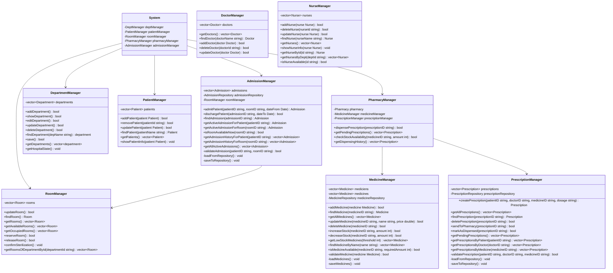

```mermaid
classDiagram

    class System {
        -DeptManager deptManager
        -PatientManager patientManager
        -RoomManager roomManager
        -PharmacyManager pharmacyManager
        -AdmissionManager admissionManager
    }

    class AdmissionManager {
        -vector~Admission~ admissions
        -AdmissionRepository admissionRepository
        -RoomManager roomManager
        +admitPatient(patientID string, roomID string, dateFrom Date) Admission
        +dischargePatient(admissionID string, dateTo Date) bool
        +findAdmission(admissionID string) Admission
        +getActiveAdmissionForPatient(patientID string) Admission
        +getActiveAdmissionForRoom(roomID string) Admission
        +isRoomAvailableNow(roomID string) bool
        +getAdmissionHistoryForPatient(patientID string) vector~Admission~
        +getAdmissionHistoryForRoom(roomID string) vector~Admission~
        +getAllActiveAdmissions() vector~Admission~
        -validateAdmission(patientID string, roomID string) bool
        -loadFromRepository() void
        -saveToRepository() void
    }

    class DoctorManager {
        -vector~Doctor~ doctors
        +getDoctors() vector~Doctor~
        +findDoctor(doctorName string) Doctor
        +addDoctor(doctor Doctor) bool
        +deleteDoctor(doctorId string) bool
        +updateDoctor(doctor Doctor) bool
    }

    class MedicineManager {
        -vector~Medicine~ mediciens
        -vector~Medicine~ medicines
        -MedicineRepository medicineRepository
        +addMedicine(medicine Medicine) bool
        +findMedicine(medicineID string) Medicine
        +getAllMedicines() vector~Medicine~
        +updateMedicine(medicineID string, name string, price double) bool
        +deleteMedicine(medicineID string) bool
        +increaseStock(medicineID string, amount int) bool
        +decreaseStock(medicineID string, amount int) bool
        +getLowStockMedicines(threshold int) vector~Medicine~
        +findMedicineByName(name string) vector~Medicine~
        +isMedicineAvailable(medicineID string, requiredAmount int) bool
        -validateMedicine(medicine Medicine) bool
        -loadMedicines() void
        -saveMedicines() void
    }

    class DepartmentManager {
        -vector~Department~ departments
        +addDepartment() bool
        +showDepartment() bool
        +editDepartment() bool
        +updateDepartment() bool
        +deleteDepartment() bool
        +findDepartment(depName string) department
        +save() bool
        +getDepartments() vector~department~
        +getHospitalState() void
    }

    class RoomManager {
        -vector~Room~ rooms
        +updateRoom() bool
        +findRoom() Room
        +getRooms() vector~Room~
        +getAvailableRooms() vector~Room~
        +getOccupiedRooms() vector~Room~
        +reserveRoom() bool
        +releaseRoom() bool
        +confirmSterilization() void
        +getRoomsOfDepartmentById(departmentId string) vector~Room~
    }

    class PatientManager {
        -vector~Patient~ patients
        +addPatient(patient Patient) bool
        +removePatient(patientId string) bool
        +updatePatient(patient Patient) bool
        +findPatient(patientName string) Patient
        +getPatients() vector~Patient~
        +showPatientInfo(patient Patient) void
    }

    class PharmacyManager {
        -Pharmacy pharmacy
        -MedicineManager medicineManager
        -PrescriptionManager prescriptionManager
        +dispensePrescription(prescriptionID string) bool
        +getPendingPrescriptions() vector~Prescription~
        +checkStockAvailability(medicineID string, amount int) bool
        +getDispensingHistory() vector~Prescription~
    }

    class PrescriptionManager {
        -vector~Prescription~ prescriptions
        -PrescriptionRepository prescriptionRepository
        +createPrescription(patientID string, doctorID string, medicineID string, dosage string) Prescription
        +getAllPrescriptions() vector~Prescription~
        +findPrescription(prescriptionID string) Prescription
        -deletePrescription(prescriptionID string) bool
        +sendToPharmacy(prescriptionID string) bool
        +markAsDispensed(prescriptionID string) bool
        +getPendingPrescriptions() vector~Prescription~
        +getPrescriptionsByPatient(patientID string) vector~Prescription~
        +getPrescriptionsByDoctor(doctorID string) vector~Prescription~
        +getPrescriptionsByMedicine(medicineID string) vector~Prescription~
        -validatePrescription(patientID string, doctorID string, medicineID string) bool
        -loadFromRepository() void
        -saveToRepository() void
    }

    class NurseManager {
        -vector~Nurse~ nurses
        +addNurse(nurse Nurse) bool
        +deleteNurse(nurseId string) bool
        +updateNurse(nurse Nurse) bool
        +findNurse(nurseName string) Nurse
        +getNurses() vector~Nurse~
        +showNurseInfo(nurse Nurse) void
        +getNurseById(id string) Nurse
        +getNursesByDept(deptId string) vector~Nurse~
        +isNurseAvailable(id string) bool
    }

    System --> DepartmentManager
    System --> PatientManager
    System --> RoomManager
    System --> PharmacyManager
    System --> AdmissionManager
    PharmacyManager --> MedicineManager
    PharmacyManager --> PrescriptionManager
    AdmissionManager --> RoomManager
```
